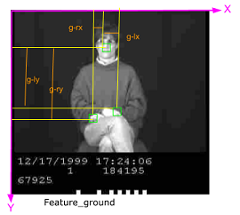

## Artificial Intelligence Projects for [Udacity Artificial Intelligence ND](https://www.udacity.com/course/artificial-intelligence-nanodegree--nd889)

Udacity Artificial Intelligence ND is an advanced course. We built projects for broad field of artificial intelligence. The projects are:
* [Use HMM to Recognize ASL](#asl), 
* [Bayes Nets](#probability),
* [Create a Domain-Independent Planner](#planning), 
* [Build an Adversarial Search Agent](#minmax), 
* [Solving Sudoku with AI](#sudoku)

<sub>*Udacity Deep Learning is an ongoing course. For academic integrity, the source code of my implementation are private. If you like to view the code, please let me know.*</sub>

<a id='asl'></a>
### American Sign Language Recognizer (Use HMM to Recognize ASL)
The overall goal of this project is to build a word recognizer for American Sign Language video sequences, demonstrating the power of probabalistic models.  In particular, this project employs  [hidden Markov models (HMM's)](https://en.wikipedia.org/wiki/Hidden_Markov_model) to analyze a series of measurements taken from videos of American Sign Language (ASL) collected for research (see the [RWTH-BOSTON-104 Database](http://www-i6.informatik.rwth-aachen.de/~dreuw/database-rwth-boston-104.php)).  In this video, the right-hand x and y locations are plotted as the speaker signs the sentence.
[](https://drive.google.com/open?id=0B_5qGuFe-wbhUXRuVnNZVnMtam8)

I implemented a half of dozen features. Below is an example of feature selections:



The Model Selectors: 
* Cross Validation fold, use sklearn KFold 
* Bayesian information Criterion, use hmmlearn GaussianHMM 
* Discriminative Information Criterion, use hmmlearn GaussianHMM 

The Recognizer trains the models for each word and test the models with sentences for each combination of features and selectors. The best result I have achieved is 60% accuracy or 40% error rate (WER), see below. Under 60% WER is considerated as a reasonable model.  

``` 
**** WER = 0.4044943820224719
Total correct: 106 out of 178
Video  Recognized                                                    Correct
=====================================================================================================
  100: POSS NEW CAR BREAK-DOWN                                       POSS NEW CAR BREAK-DOWN
    2: JOHN WRITE HOMEWORK                                           JOHN WRITE HOMEWORK
    .......
```

<a id='probability'></a>
### Bayes Nets
coming soon

<a id='planning'></a>
### Air Cargo Problem (Create a Domain-Independent Planner)
coming soon
https://github.com/mingrutar/aind_project3_search

<a id='minmax'></a>
### Chess-like Isolated Game (Build an Adversarial Search Agent)
coming soon

<a id='sudoku'></a>
### Sudoku (Solving Sudoku with AI)

https://github.com/mingrutar/aind_projects/tree/master/project1-sudoku

